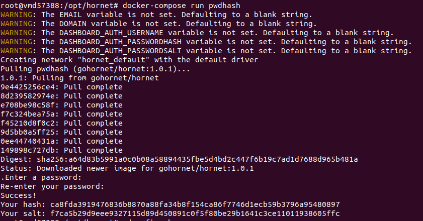
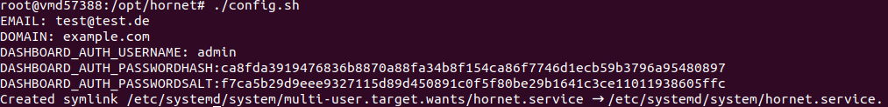

## Info
This setup only works with a correct domain.

## install docker
```console
curl -LO https://raw.githubusercontent.com/Alps86/iota-hornet-docker/master/setup.sh
chmod +x setup.sh
./setup.sh
```

### change the config
1. go to insalltion directory
```console
cd /opt/hornet
```
2. use **docker-compose run pwdhash** for the hash and salt generation (ignore the Warnings)
   ```console
    docker-compose run pwdhash
    ```
   
3. copy & paste the hash and salt in the next step in **congig.sh**
   ```console
    ./config.sh
    ```
   

## start node
```console
service hornet start
```

## stop node
```console
service hornet stop
```

## visit the dashboard
```console
https://example.com
```
